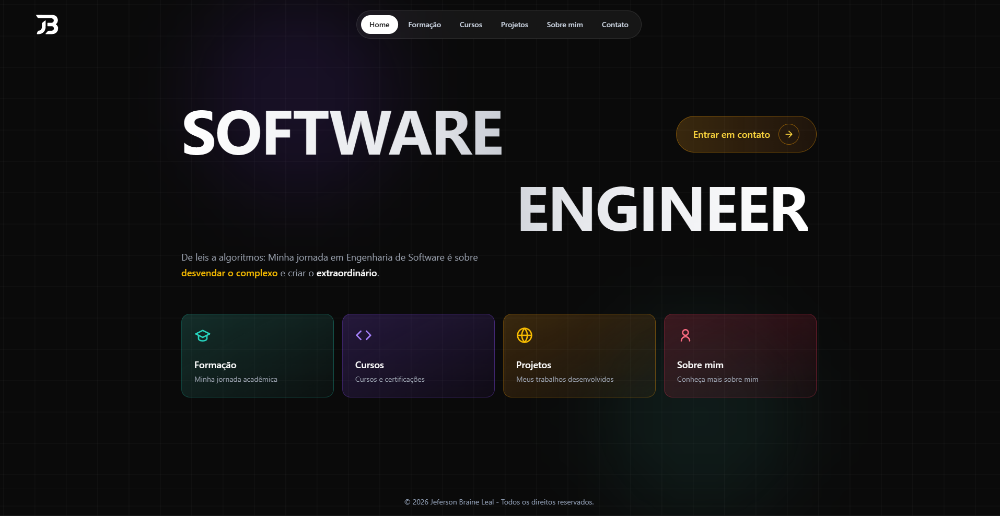

# Portfólio Angular | Jeferson Braine Leal

<p align="center">
  
</p>

<p align="center">
  <a href="https://angular.dev/"></a>
  <a href="https://www.typescriptlang.org/"></a>
  <a href="https://tailwindcss.com/"></a>
  <a href="https://vitest.dev/"></a>
</p>

<p align="center">
  Um portfólio pessoal reconstruído em Angular para apresentar trajetória, habilidades e projetos com narrativa, performance e acabamento visual.
</p>

---

## Sobre o projeto

Este projeto é a versão em Angular do meu portfólio profissional. A proposta não é ser apenas uma página com links: cada seção foi pensada para comunicar quem eu sou como engenheiro de software, quais problemas eu resolvo e como tomo decisões técnicas.

A aplicação funciona como uma landing page interativa com navegação por seções, cards animados, cases de projeto em modal, formulário de contato com validações e uma identidade visual escura, moderna e responsiva.

## Destaques

- Hero section com chamada visual forte e CTA direto para contato.
- Navegação por seções: Formação, Cursos, Projetos, Sobre mim e Contato.
- Seção de projetos com filtros por categoria: Todos, Web, Full-Stack e Python.
- Cards de projeto com contexto, solução técnica, stack, status e lições aprendidas.
- Modal de case study para apresentar projetos com profundidade.
- Página "Sobre mim" com foto, estatísticas, habilidades, interesses e links profissionais.
- Formulário reativo com validação, sanitização básica e estado de envio.
- Componentes compartilhados de UI para inputs, botões, badges, tabs, labels e textarea.
- Preparado com Angular SSR e servidor Express.

## Preview

<p align="center">
  
</p>

O portfólio apresenta Jeferson Braine Leal, engenheiro de software de Cerro Azul, Brasil, com experiência em Angular, TypeScript, Python, C#, APIs REST, bancos de dados e automação de processos.

## Stack

| Camada | Tecnologias |
| --- | --- |
| Framework | Angular 21 |
| Linguagem | TypeScript 5.9 |
| Estilo | Tailwind CSS 4, CSS componentizado |
| Forms | Angular Reactive Forms |
| Renderização | Angular SSR, Express |
| Testes | Vitest, jsdom |
| Build | Angular CLI, npm |
| Qualidade | Prettier, budgets de produção |

## Estrutura

```text
src/
  app/
    features/
      landing/
        sections/
          home/          # Hero e cards de navegação
          projetos/      # Lista, filtros e modal de projetos
          sobre-mim/     # Perfil, skills, contatos e interesses
          contato/       # Formulário reativo e canais de contato
          formacao/      # Formação acadêmica
          cursos/        # Cursos e certificações
        admin/           # Componentes administrativos/apoio visual
      projects/
        project-moda/    # Página dedicada de projeto
    layout/
      navbar/            # Navegação principal
      footer/            # Rodapé
    shared/
      ui/                # Componentes reutilizáveis
public/
  assets/
    banner-portfolio.png
    logo/logoSigla.svg
    profile-picture/eu.jpg
```

## Como rodar localmente

Clone o repositório:

```bash
git clone https://github.com/jefersonbraine/portfolio-angular.git
cd portfolio-angular
```

Instale as dependências:

```bash
npm install
```

Inicie o servidor de desenvolvimento:

```bash
npm start
```

Acesse:

```text
http://localhost:4200
```

## Scripts disponíveis

| Comando | Descrição |
| --- | --- |
| `npm start` | Inicia o servidor local com live reload |
| `npm run build` | Gera a build de produção em `dist/` |
| `npm run watch` | Executa build em modo observação |
| `npm test` | Executa os testes com Vitest |
| `npm run serve:ssr:portfolio-angular` | Serve a build SSR gerada |

## Decisões técnicas

- **Angular moderno**: componentes standalone, control flow nativo (`@for`, `@if`, `@switch`) e signals para estado local.
- **UI orientada a dados**: cards, projetos, skills e contatos são renderizados a partir de arrays tipados.
- **Links externos tratados com cuidado**: sanitização de URLs e validação de protocolos/hosts onde faz sentido.
- **Formulário robusto**: validações de campos obrigatórios, tamanho máximo, telefone, opções permitidas e conteúdo suspeito.
- **Performance visual**: animações baseadas em classes e transições leves, evitando lógica pesada na camada de template.
- **Assets locais**: banner, logo e foto de perfil servidos pela pasta `public/assets`.

## Projetos apresentados

- **Portfolio Website**: frontend/design com foco em narrativa visual e boas práticas.
- **Ecommerce Website**: experiência full-stack com autenticação, pagamento e recomendações por IA.
- **Conecta Doc**: SaaS documental em andamento com Angular, Supabase e TypeScript.
- **Iniciando.dev**: site institucional de marca tech com foco em SEO e conversão.
- **Password Manager**: aplicação desktop em Python com criptografia AES-256.

## Roadmap

- Publicar versão final em produção.
- Adicionar links reais de demo, código, documentação e vídeos para cada projeto.
- Integrar envio real do formulário de contato.
- Expandir testes dos componentes principais.
- Melhorar SEO com metadados por seção e preview social.

## Autor

**Jeferson Braine Leal**  
Engenheiro de Software

- GitHub: [github.com/jefersonbraine](https://github.com/jefersonbraine)
- LinkedIn: [linkedin.com/in/jefersonbraineleal](https://linkedin.com/in/jefersonbraineleal)
- Email: [jefersonbraineleal@gmail.com](mailto:jefersonbraineleal@gmail.com)

---

<p align="center">
  Feito com Angular, TypeScript e atenção aos detalhes.
</p>
